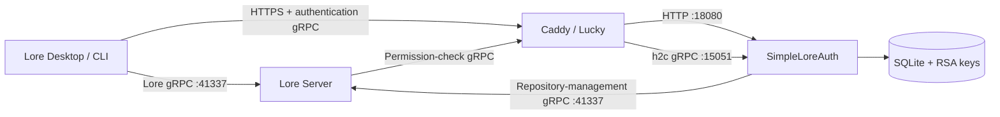

# SimpleLoreAuth

[简体中文](README.md) | [English](README.en.md)

An independent authentication and authorization service for
[EpicGames/lore](https://github.com/EpicGames/lore), designed for home NAS devices,
small teams, and private-network deployments.

SimpleLoreAuth implements the authentication gRPC APIs used by Lore clients and
Lore Server. It also provides username/password login, a Chinese web-based admin
console, user administration, repository permissions, and repository management.
It integrates through Lore's standard protocols and does not require changes to
the Lore source code.

> [!IMPORTANT]
> This is a community project. It is not an official Epic Games authentication
> service and is not affiliated with Epic Games. Validate it in a trusted test
> environment before using it with important data.

## Features

- Implements the Lore `UrcAuthApi` gRPC protocol for login, token exchange, and
  permission queries.
- Implements the `RebacApi` used when Lore creates, lists, and deletes repositories.
- Browser-based username/password login compatible with interactive login in
  Lore Desktop and Lore CLI.
- SQLite user database with Argon2id password hashing.
- RS256 JWT signing and a standard `/.well-known/jwks.json` endpoint.
- Create, enable, disable, update, and delete regular user accounts.
- Grant per-repository read, write, repository-management, or full permissions.
- Chinese web administration console.
- Read the repository list from Lore Server in real time.
- View the latest 50 commits for a repository.
- Permanently delete a repository after confirming its name.
- Docker Compose deployment with Caddy HTTPS and gRPC/h2c routing.
- Command-line tools for user and permission administration.

External OIDC providers, third-party login, and API-key login are not currently
implemented. Calls to those APIs return `UNIMPLEMENTED`.

## Architecture



The HTTP login pages and authentication gRPC service share one public address.
The Lore Server repository endpoint is a separate service and must not be confused
with the authentication endpoint.

## Ports

| Port | Protocol | Purpose | Public exposure |
|---|---|---|---|
| `18080` | HTTP/1.1 | Login UI, admin console, health check, and JWKS | No |
| `15051` | h2c gRPC | Lore authentication and authorization APIs | No |
| `10443` | HTTPS + HTTP/2 | Unified public Caddy endpoint | Yes, or expose only to an upstream reverse proxy |
| `41337` | h2c gRPC | Lore Server repository service; not part of SimpleLoreAuth | Depends on your network design |

Ports `18080` and `15051` use plaintext protocols inside the Compose network.
They should only be available on a trusted host or Docker network.

## Quick Start

### 1. Prepare the environment

```bash
cp .env.example .env
```

Edit `.env`:

```env
LORE_AUTH_DOMAIN=auth.example.com
LORE_AUTH_PUBLIC_BASE_URL=https://auth.example.com:10443
LORE_AUTH_ISSUER=https://auth.example.com:10443
LORE_AUTH_AUDIENCE=lore-service
LORE_AUTH_ENVIRONMENT=home
LORE_AUTH_TOKEN_TTL_SECONDS=3600
LORE_AUTH_LORE_GRPC_URL=http://192.168.1.10:41337
LORE_AUTH_BOOTSTRAP_USERNAME=admin
LORE_AUTH_BOOTSTRAP_PASSWORD=replace-with-a-strong-password-of-at-least-ten-characters
```

| Variable | Required | Description |
|---|---|---|
| `LORE_AUTH_DOMAIN` | Yes | Certificate hostname only; do not include a scheme, port, or path |
| `LORE_AUTH_PUBLIC_BASE_URL` | Yes | Complete public URL used by clients, including a non-standard port |
| `LORE_AUTH_ISSUER` | Yes | JWT issuer; must exactly match Lore Server's `jwt_issuer` |
| `LORE_AUTH_AUDIENCE` | No | JWT audience; defaults to `lore-service` |
| `LORE_AUTH_ENVIRONMENT` | No | Environment identifier stored in tokens; defaults to `local` |
| `LORE_AUTH_TOKEN_TTL_SECONDS` | No | JWT lifetime in seconds; defaults to `3600` |
| `LORE_AUTH_LORE_GRPC_URL` | For repository administration | Internal Lore Server gRPC URL used by the admin console |
| `LORE_AUTH_BOOTSTRAP_USERNAME` | Yes | Super-administrator username; defaults to `admin` |
| `LORE_AUTH_BOOTSTRAP_PASSWORD` | On first start | Password used to create the super-administrator account |

On every start, the bootstrap administrator is restored to an enabled state and
receives global `urc-*` permissions. This account cannot be disabled or deleted
from the web console.

### 2. Choose a TLS setup

#### Option A: Caddy obtains a certificate automatically

The default `Caddyfile` uses `LORE_AUTH_DOMAIN` and lets Caddy manage the
certificate. Your DNS and network must satisfy the Caddy/ACME validation
requirements.

```bash
docker compose up -d --build
```

#### Option B: Lucky or another reverse proxy with an existing certificate

Place the certificate and private key at:

```text
certs/server.pem
certs/server.key
```

Use the manual-certificate configuration:

```bash
cp Caddyfile.manual-tls.example Caddyfile
docker compose up -d --build
```

If the public address is `https://auth.example.com:2234`, update `.env`:

```env
LORE_AUTH_PUBLIC_BASE_URL=https://auth.example.com:2234
LORE_AUTH_ISSUER=https://auth.example.com:2234
```

Example Lucky backend settings:

```text
Backend address: https://NAS-LAN-IP:10443
Ignore backend TLS certificate verification: Yes
Use secure connection for gRPC: Yes
Disable persistent connections: No
```

HTTP/2 must be preserved. If normal web pages work but gRPC returns
`grpc-status: 14`, Lucky usually does not have **Use secure connection for gRPC**
enabled.

### 3. Verify the service

```bash
docker compose ps
curl https://auth.example.com:10443/health
curl https://auth.example.com:10443/.well-known/jwks.json
```

The health endpoint should return:

```json
{"status":"ok"}
```

View logs with:

```bash
docker compose logs --tail=100 caddy lore-auth
```

## Configure Lore Server

Merge the contents of `lore-server.local.toml.example` into the local Lore Server
configuration. All three public URLs must use exactly the same scheme, hostname,
and port:

```toml
[environment.endpoint]
auth_url = "https://auth.example.com:10443"

[server.auth]
jwt_issuer = "https://auth.example.com:10443"
jwt_audience = ["lore-service"]

[server.auth.jwk]
endpoint = "https://auth.example.com:10443/.well-known/jwks.json"
```

If the public authentication port is `2234`, change all three URLs to port
`2234`, then restart Lore Server.

`environment.endpoint.auth_url` is returned to Lore clients and is also used by
Lore Server for authorization queries. If it is incorrect, client debug logs may
show:

```text
starting auth session failed to connect to auth endpoint
```

## Client Login

CLI example:

```bash
lore auth login lore://your-lore-server:41337
```

After adding a remote address, Lore Desktop automatically opens the login page.
The success page displays an authentication success message, and the client then
stores its token in the local secure credential directory.

The admin-console cookie and the Lore Desktop token are independent. Signing in
to `/admin` does not sign Lore Desktop in.

## Web Administration Console

Open:

```text
https://auth.example.com:10443/admin
```

The console is currently presented in Chinese and supports:

- Creating, enabling, disabling, and deleting regular users.
- Resetting user passwords.
- Viewing user IDs and account status.
- Granting or revoking per-repository permissions.
- Viewing Lore Server repositories in real time.
- Viewing a repository's default branch, creator, creation time, and commit history.
- Permanently deleting a Lore repository.

Repository administration requires:

```env
LORE_AUTH_LORE_GRPC_URL=http://NAS-LAN-IP:41337
```

Repository deletion is irreversible. Back up the Lore data directory first.

## Command-Line Administration

Create a user:

```bash
docker compose exec \
  -e LORE_AUTH_PASSWORD='a-strong-user-password' \
  lore-auth lore-auth user add --username alice --display-name 'Alice'
```

List, disable, and enable users:

```bash
docker compose exec lore-auth lore-auth user list
docker compose exec lore-auth lore-auth user disable alice
docker compose exec lore-auth lore-auth user enable alice
```

Reset a password:

```bash
docker compose exec \
  -e LORE_AUTH_PASSWORD='a-new-strong-password' \
  lore-auth lore-auth user password alice
```

Manage repository permissions:

```bash
docker compose exec lore-auth lore-auth grant set alice \
  urc-0194b726b34e72b0b45550b88a967076 \
  --permissions read,write

docker compose exec lore-auth lore-auth grant list alice

docker compose exec lore-auth lore-auth grant revoke alice \
  urc-0194b726b34e72b0b45550b88a967076
```

## Data and Backups

Persistent data is stored in:

```text
./data/lore-auth.db
./data/private-key.pem
./data/public-key.pem
```

The database contains accounts, password hashes, repository grants, and
repository-ownership records. The RSA private key signs tokens. Back up the whole
`data` directory and protect the private key carefully:

- Losing the database loses accounts and grants.
- Losing the private key invalidates previously issued tokens.
- Leaking the private key allows an attacker to forge tokens.

`.env`, `data/`, `certs/`, and `target/` are excluded from Git by default.

## Security Notes

- Only the bootstrap super-administrator can use the admin console.
- Admin sessions are stored in memory and expire after eight hours.
- Cookies use `Secure`, `HttpOnly`, and `SameSite=Strict`.
- All administrative forms use CSRF tokens.
- Disabling a user immediately blocks new login and token-exchange attempts.
- Already-issued JWTs may remain valid until they expire; shorten
  `LORE_AUTH_TOKEN_TTL_SECONDS` if required.
- Do not expose ports `18080`, `15051`, or the SQLite database to untrusted networks.
- Avoid granting the global `urc-*` wildcard to regular users.

## Updating

After updating the source code, run:

```bash
docker compose up -d --build --force-recreate
```

Do not delete the `data` directory and do not run `docker compose down -v` unless
you intend to remove persistent data or Caddy state.

## Troubleshooting

### Web pages work, but Lore Server reports `Failed to connect to lore auth service`

Check that:

1. `environment.endpoint.auth_url` is the actual public authentication URL.
2. The reverse proxy supports HTTP/2 gRPC.
3. Lucky has **Use secure connection for gRPC** enabled.
4. Caddy uses `h2c` for its gRPC upstream.

### Lore Desktop reports `Not authenticated`

Inspect the `authLoginInteractive` debug event. Confirm that browser login
succeeded and that Lore Server returns the correct `auth_url` port. Admin-console
login cannot replace client login.

### SQLite reports `Unable to open the database file`

Ensure that `./data` exists and is writable by the container user:

```bash
mkdir -p data
chmod 770 data
```

### Caddy TLS handshake fails

Check the certificate mount paths, confirm that the certificate matches its
private key, and ensure that `Caddyfile` refers to `/certs/...` paths inside the
container.

## Local Development

```bash
cargo fmt --all -- --check
cargo test --locked
cargo clippy --all-targets --locked -- -D warnings
```

For loopback-only plaintext development:

```bash
cargo run --locked -- \
  --data-dir ./data \
  serve \
  --public-base-url http://127.0.0.1:18080 \
  --issuer http://127.0.0.1:18080 \
  --bootstrap-username admin \
  --bootstrap-password a-long-development-password
```

## License

[MIT](LICENSE)
