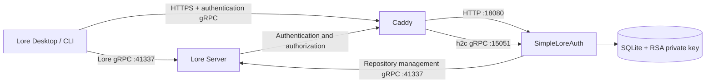

# SimpleLoreAuth

[简体中文](README.md) | [English](README.en.md)

SimpleLoreAuth is an independent authentication and authorization service for self-hosted [EpicGames/lore](https://github.com/EpicGames/lore) servers. It implements Lore's standard authentication gRPC APIs and provides browser login, user administration, repository authorization, and repository management without modifying Lore.

> [!IMPORTANT]
> This is a community project. It is not an official Epic Games authentication service and is not affiliated with Epic Games. Validate compatibility and backup recovery in a controlled environment before using it with important data.

## Features

- Implements Lore `UrcAuthApi` login, token exchange, and permission queries.
- Implements the `RebacApi` used when Lore creates, lists, and deletes repositories.
- Supports browser-based interactive login from Lore Desktop and Lore CLI.
- Stores Argon2id password hashes, users, and grants in SQLite.
- Signs RS256 JWTs and exposes a standard `/.well-known/jwks.json` endpoint.
- Creates, enables, disables, deletes, and resets regular user accounts.
- Assigns read, write, repository-management, or full permissions per repository.
- Provides a Chinese web administration console.
- Reads Lore Server repositories and their latest 50 commits.
- Permanently deletes Lore repositories after confirmation.
- Ships an all-in-one Docker image containing SimpleLoreAuth and Caddy.
- Includes command-line user and grant administration tools.

External OIDC providers, third-party login, and API-key login are not implemented. Calls to those APIs return `UNIMPLEMENTED`.

## Architecture



The login pages, administration console, JWKS endpoint, and authentication gRPC service share one HTTPS address. The Lore Server repository endpoint is a separate service and must not be used as the authentication endpoint.

## Ports

| Port | Protocol | Purpose | Exposure |
|---|---|---|---|
| `10443` | HTTPS + HTTP/2 | All-in-one container entry point | Publish on the host or behind an upstream proxy |
| `18080` | HTTP/1.1 | Login, administration, health, and JWKS | Container loopback only |
| `15051` | h2c gRPC | Lore authentication and authorization APIs | Container loopback only |
| `41337` | h2c gRPC | Lore Server repository service | Provided separately by Lore Server |

The image exposes only port `10443`. Ports `18080` and `15051` are used exclusively between Caddy and SimpleLoreAuth inside the container.

## Docker Image

GitHub Actions builds the all-in-one image for `linux/amd64` and `linux/arm64`:

```text
ghcr.io/rogue324/simpleloreauth:latest
```

Available tags:

- `latest`: latest successful build from `main`.
- `sha-xxxxxxx`: a specific Git commit.
- `v1.2.3`, `1.2.3`, and `1.2`: generated from a `v1.2.3` release tag.

Set `LORE_AUTH_IMAGE` to select another image tag:

```env
LORE_AUTH_IMAGE=ghcr.io/rogue324/simpleloreauth:v1.2.3
```

## Quick Start

### 1. Prepare the configuration

```bash
cp .env.example .env
```

Edit `.env`:

```env
LORE_AUTH_URL=https://auth.example.com:10443
LORE_AUTH_PASSWORD=replace-with-a-long-random-password
LORE_SERVER_URL=http://lore-server:41337
LORE_AUTH_TLS_MODE=manual

LORE_AUTH_DATA_DIR=./data
CADDY_CERTS_DIR=./certs
LORE_AUTH_HTTPS_PORT=10443
```

| Variable | Required | Description |
|---|---|---|
| `LORE_AUTH_URL` | Yes | Exact HTTPS URL used by clients; also the JWT issuer and the source for the audience and certificate host name |
| `LORE_AUTH_PASSWORD` | First start | Initial password for bootstrap administrator `admin`; use a strong random value |
| `LORE_SERVER_URL` | Repository administration | Lore Server gRPC URL used by the web console; may be empty when repository management is not required |
| `LORE_AUTH_TLS_MODE` | No | `manual` (default) uses existing certificate files; `auto` lets Caddy obtain a certificate |
| `LORE_AUTH_DATA_DIR` | No | Host persistence directory, default `./data` |
| `CADDY_CERTS_DIR` | Manual TLS | Host certificate directory, default `./certs` |
| `LORE_AUTH_HTTPS_PORT` | No | Host TCP port mapped to container port `10443`, default `10443` |

The bootstrap administrator is restored to an enabled state on every start and receives global `urc-*` permissions. It cannot be disabled or deleted from the web console.

### 2. Configure TLS

#### Manual certificate

Set:

```env
LORE_AUTH_TLS_MODE=manual
```

Store the complete certificate chain and private key as:

```text
./certs/server.pem
./certs/server.key
```

The certificate must cover the host name in `LORE_AUTH_URL`, and the private key must match the certificate. Compose mounts the certificate directory read-only at `/certs`.

#### Automatic certificate with Caddy

Set:

```env
LORE_AUTH_TLS_MODE=auto
```

Caddy derives the host name from `LORE_AUTH_URL`. DNS, ingress ports, and firewall rules must satisfy ACME validation. Persist `/caddy-data` and `/caddy-config`; the default `compose.yaml` already defines these volumes.

### 3. Start the service

```bash
docker compose pull
docker compose up -d
```

Check status and logs:

```bash
docker compose ps
docker compose logs --tail=100 lore-auth
```

Verify the HTTP endpoints:

```bash
curl https://auth.example.com:10443/health
curl https://auth.example.com:10443/.well-known/jwks.json
```

The health endpoint should return:

```json
{"status":"ok"}
```

## Direct Docker Run

Manual-certificate example:

```bash
docker run -d \
  --name simpleloreauth \
  --restart unless-stopped \
  -p 10443:10443 \
  -e LORE_AUTH_URL=https://auth.example.com:10443 \
  -e LORE_AUTH_PASSWORD=replace-with-a-long-random-password \
  -e LORE_SERVER_URL=http://lore-server:41337 \
  -e LORE_AUTH_TLS_MODE=manual \
  -v "$PWD/data:/data" \
  -v "$PWD/certs:/certs:ro" \
  -v simpleloreauth-caddy-data:/caddy-data \
  -v simpleloreauth-caddy-config:/caddy-config \
  ghcr.io/rogue324/simpleloreauth:latest
```

The image declares four runtime environment variables so container-management tools can display them directly:

- `LORE_AUTH_URL`.
- `LORE_AUTH_PASSWORD`.
- `LORE_SERVER_URL`.
- `LORE_AUTH_TLS_MODE`.

Other settings use image defaults to avoid duplicated configuration.

## Configure Lore Server

Merge `lore-server.local.toml.example` into the local Lore Server configuration. The following relationship is mandatory:

- `auth_url`: the complete SimpleLoreAuth HTTPS URL.
- `jwt_issuer`: exactly equal to `LORE_AUTH_URL`, including the scheme and any non-default port.
- `jwt_audience`: the host name from `LORE_AUTH_URL`, without the scheme, port, or path.
- JWK `endpoint`: the complete authentication URL followed by `/.well-known/jwks.json`.

Example:

```toml
[environment.endpoint]
auth_url = "https://auth.example.com:10443"

[server.auth]
jwt_issuer = "https://auth.example.com:10443"
jwt_audience = ["auth.example.com"]

[server.auth.jwk]
endpoint = "https://auth.example.com:10443/.well-known/jwks.json"
```

SimpleLoreAuth derives the audience automatically from `LORE_AUTH_URL`. In the example above:

```text
LORE_AUTH_URL  = https://auth.example.com:10443
JWT Issuer     = https://auth.example.com:10443
JWT Audience   = auth.example.com
```

If the legacy advanced variable `LORE_AUTH_AUDIENCE` is set explicitly, it must equal the derived host name. Otherwise, the service refuses to start and reports the expected value. Restart Lore Server after changing its configuration.

## Upstream Reverse Proxy

When placing another reverse proxy in front of the all-in-one container, direct its backend to the container's HTTPS port `10443` and meet these requirements:

- Preserve HTTP/2.
- Support gRPC long-lived connections and trailers.
- Do not configure the HTTPS backend as plaintext HTTP.
- Keep the external address exactly equal to `LORE_AUTH_URL`.
- Use a certificate that covers the client-facing host name.

If web pages work but gRPC returns `grpc-status: 14`, inspect HTTP/2 and gRPC proxy settings first.

## Client Login

Lore CLI example:

```bash
lore auth login lore://your-lore-server:41337
```

Lore Desktop opens the browser login page after a remote is added. After successful login, the client stores its token in the local credential store.

The administration cookie and Lore client token are independent. Signing in to `/admin` does not sign Lore Desktop in.

## Web Administration Console

Open:

```text
https://auth.example.com:10443/admin
```

The console supports:

- Creating, enabling, disabling, and deleting regular users.
- Resetting user passwords.
- Viewing user IDs and account status.
- Granting or revoking per-repository permissions.
- Viewing Lore Server repositories in real time.
- Viewing repository metadata and recent commits.
- Permanently deleting Lore repositories.

Repository administration requires a valid `LORE_SERVER_URL`. Repository deletion is irreversible; verify backups first.

## Command-Line Administration

Create a user:

```bash
docker compose exec \
  -e LORE_AUTH_PASSWORD='a-strong-user-password' \
  lore-auth lore-auth user add --username alice --display-name 'Alice'
```

List, disable, and enable users:

```bash
docker compose exec lore-auth lore-auth user list
docker compose exec lore-auth lore-auth user disable alice
docker compose exec lore-auth lore-auth user enable alice
```

Reset a password:

```bash
docker compose exec \
  -e LORE_AUTH_PASSWORD='a-new-strong-password' \
  lore-auth lore-auth user password alice
```

Manage repository grants:

```bash
docker compose exec lore-auth lore-auth grant set alice \
  urc-0194b726b34e72b0b45550b88a967076 \
  --permissions read,write

docker compose exec lore-auth lore-auth grant list alice

docker compose exec lore-auth lore-auth grant revoke alice \
  urc-0194b726b34e72b0b45550b88a967076
```

## Data and Backups

The persistent `/data` directory contains:

```text
lore-auth.db
jwt-private.pem
```

The database stores accounts, password hashes, repository grants, and ownership records. The RSA private key signs tokens. Back up the complete data directory and protect the private key:

- Losing the database loses accounts and grants.
- Losing the private key invalidates previously issued tokens.
- Leaking the private key allows an attacker to forge tokens.

Do not run `docker compose down -v` or remove the data directory when data must be retained.

## Security Notes

- Only the bootstrap administrator can access the administration console.
- Administration sessions are stored in memory and expire after eight hours.
- Cookies use `Secure`, `HttpOnly`, and `SameSite=Strict`.
- All administration forms use CSRF tokens.
- Disabling a user immediately blocks new login and token-exchange attempts.
- Issued JWTs may remain valid until they expire.
- Do not expose ports `18080`, `15051`, or the SQLite database to untrusted networks.
- Avoid granting the global `urc-*` wildcard to regular users.

## Updating

```bash
docker compose pull
docker compose up -d --force-recreate
```

Build locally only for development or source modifications:

```bash
docker compose -f compose.yaml -f compose.build.yaml up -d --build
```

## Troubleshooting

### Lore Server reports `Failed to connect to lore auth service`

Check `environment.endpoint.auth_url`, the TLS certificate, network reachability, and HTTP/2 gRPC support in any upstream proxy.

### Lore Desktop reports `Not authenticated`

Inspect the `authLoginInteractive` debug event, confirm that browser login completed, and verify that Lore Server returns the actual authentication URL.

### Lore Server reports `InvalidIssuer` or the client rejects the token

Verify that `jwt_issuer` exactly equals `LORE_AUTH_URL` and that `jwt_audience` contains only the authentication host name. For `https://auth.example.com:10443`, the audience must be `auth.example.com`.

### SQLite reports `Unable to open the database file`

Ensure that the data directory exists and is writable by container UID `10001`:

```bash
mkdir -p data
chmod 770 data
```

### Caddy TLS handshake fails

Confirm that `/certs/server.pem` contains the complete chain, `/certs/server.key` matches the certificate, and both mounted files are readable.

## Local Development

```bash
cargo fmt --all -- --check
cargo test --locked
cargo clippy --all-targets --locked -- -D warnings
```

For loopback-only plaintext development:

```bash
cargo run --locked -- \
  --data-dir ./data \
  serve \
  --public-base-url http://127.0.0.1:18080 \
  --issuer http://127.0.0.1:18080 \
  --bootstrap-username admin \
  --bootstrap-password a-long-development-password
```

## License

[MIT](LICENSE)
