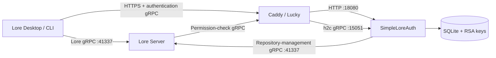

# SimpleLoreAuth

[简体中文](README.md) | [English](README.en.md)

An independent authentication and authorization service for
[EpicGames/lore](https://github.com/EpicGames/lore), designed for home NAS devices,
small teams, and private-network deployments.

SimpleLoreAuth implements the authentication gRPC APIs used by Lore clients and
Lore Server. It also provides username/password login, a Chinese web-based admin
console, user administration, repository permissions, and repository management.
It integrates through Lore's standard protocols and does not require changes to
the Lore source code.

> [!IMPORTANT]
> This is a community project. It is not an official Epic Games authentication
> service and is not affiliated with Epic Games. Validate it in a trusted test
> environment before using it with important data.

## Features

- Implements the Lore `UrcAuthApi` gRPC protocol for login, token exchange, and
  permission queries.
- Implements the `RebacApi` used when Lore creates, lists, and deletes repositories.
- Browser-based username/password login compatible with interactive login in
  Lore Desktop and Lore CLI.
- SQLite user database with Argon2id password hashing.
- RS256 JWT signing and a standard `/.well-known/jwks.json` endpoint.
- Create, enable, disable, update, and delete regular user accounts.
- Grant per-repository read, write, repository-management, or full permissions.
- Chinese web administration console.
- Read the repository list from Lore Server in real time.
- View the latest 50 commits for a repository.
- Permanently delete a repository after confirming its name.
- Docker Compose deployment with Caddy HTTPS and gRPC/h2c routing.
- Command-line tools for user and permission administration.

External OIDC providers, third-party login, and API-key login are not currently
implemented. Calls to those APIs return `UNIMPLEMENTED`.

## Architecture



The HTTP login pages and authentication gRPC service share one public address.
The Lore Server repository endpoint is a separate service and must not be confused
with the authentication endpoint.

## Ports

| Port | Protocol | Purpose | Public exposure |
|---|---|---|---|
| `18080` | HTTP/1.1 | Login UI, admin console, health check, and JWKS | No |
| `15051` | h2c gRPC | Lore authentication and authorization APIs | No |
| `10443` | HTTPS + HTTP/2 | Unified public Caddy endpoint | Yes, or expose only to an upstream reverse proxy |
| `41337` | h2c gRPC | Lore Server repository service; not part of SimpleLoreAuth | Depends on your network design |

Ports `18080` and `15051` use plaintext protocols inside the Compose network.
They should only be available on a trusted host or Docker network.

## Prebuilt Docker Images

GitHub Actions automatically builds and publishes `linux/amd64` and
`linux/arm64` images whenever a commit is pushed to `main`, a `v*` version tag is
pushed, or the workflow is started manually:

```text
ghcr.io/rogue324/simpleloreauth:latest
ghcr.io/rogue324/simpleloreauth:bundled
```

Available tags:

- `latest`: latest successful build from `main`.
- `bundled`: latest all-in-one Auth + Caddy build from `main`.
- `sha-xxxxxxx`: a specific Git commit.
- `bundled-sha-xxxxxxx`: the bundled image for a specific Git commit.
- `v1.2.3`, `1.2.3`, and `1.2`: generated when the `v1.2.3` Git tag is pushed.

The default `compose.yaml` pulls the prebuilt image, so the NAS no longer needs
to compile Rust. Set `LORE_AUTH_IMAGE` to use another tag:

```env
LORE_AUTH_IMAGE=ghcr.io/rogue324/simpleloreauth:v1.2.3
```

> [!NOTE]
> A GHCR package published under a personal GitHub account is private by default.
> After the first successful workflow run, open **Packages → simpleloreauth →
> Package settings → Change visibility** from the GitHub profile and make it
> **Public** to allow anonymous pulls from the NAS. A public package cannot be
> made private again. To keep it private, run `docker login ghcr.io` on the NAS
> before pulling.

## Quick Start

### Bundled Auth + Caddy image (recommended for NAS)

To create only one Docker container, use:

```text
ghcr.io/rogue324/simpleloreauth:bundled
```

This image runs Lore Auth and Caddy together. They communicate only through `127.0.0.1:18080` and `127.0.0.1:15051` inside the container; only container TCP port `10443` needs to be published. Built-in process supervision stops the whole container if either service exits, allowing the Docker restart policy to recover it.

At minimum, configure these values in the NAS UI:

```env
LORE_AUTH_PUBLIC_BASE_URL=https://lore.example.com:10443
LORE_AUTH_ISSUER=https://lore.example.com:10443
LORE_AUTH_BOOTSTRAP_PASSWORD=replace-with-a-long-random-password
LORE_AUTH_LORE_GRPC_URL=http://NAS-LAN-IP:41337

CADDY_TLS_MODE=manual
CADDY_CERT_FILE=/certs/server.pem
CADDY_KEY_FILE=/certs/server.key
```

Add these mappings:

- NAS data directory → `/data`, read-write.
- NAS certificate directory → `/certs`, read-only.
- NAS HTTPS port (for example `10443`) → container TCP `10443`.

For different certificate names, change `CADDY_CERT_FILE` and `CADDY_KEY_FILE`. Persist `/caddy-data` and `/caddy-config` when Caddy manages certificates automatically. Alternatively, deploy `compose.bundled.yaml` directly:

```bash
docker compose -f compose.bundled.yaml pull
docker compose -f compose.bundled.yaml up -d
```

### Create a container directly from the image

Both the pure-Auth `latest` image and the all-in-one `bundled` image declare their runtime settings in the image configuration. When a NAS Docker UI creates a container from an image, these environment variables are listed automatically in the same way as `PATH`. Settings with stable defaults are pre-filled, while deployment-specific required settings remain empty.

Required empty settings:

- `LORE_AUTH_PUBLIC_BASE_URL`: the public HTTPS URL used by clients.
- `LORE_AUTH_ISSUER`: the JWT issuer, normally the same public HTTPS URL.
- `LORE_AUTH_BOOTSTRAP_PASSWORD`: the root administrator password, required on first startup.

Normally, also set `LORE_AUTH_LORE_GRPC_URL` so the administration UI can manage Lore Server repositories. The `/data` path, HTTP port `18080`, and gRPC port `15051` are included with their defaults.

These are settings for the `lore-auth` container only. The domain, public HTTPS port, and certificates belong to the Caddy container; use the parameterized `compose.nas.yaml` deployment below or create Caddy separately.

### Parameterized NAS deployment (recommended)

`compose.nas.yaml` is designed for NAS Docker management interfaces. Authentication
settings, ports, data directories, TLS mode, and certificate locations are all
provided as Docker/Compose environment variables. Caddy generates its configuration
when the container starts, so no `Caddyfile` needs to be created or mounted.

Set the following values in the NAS Compose project environment-variable page:

```env
LORE_AUTH_IMAGE=ghcr.io/rogue324/simpleloreauth:latest
LORE_AUTH_DATA_DIR=/path/on/nas/lore-auth/data
LORE_AUTH_HTTPS_PORT=10443

LORE_AUTH_DOMAIN=auth.example.com
LORE_AUTH_PUBLIC_BASE_URL=https://auth.example.com:2234
LORE_AUTH_ISSUER=https://auth.example.com:2234
LORE_AUTH_AUDIENCE=lore-service
LORE_AUTH_ENVIRONMENT=home
LORE_AUTH_TOKEN_TTL_SECONDS=3600
LORE_AUTH_LORE_GRPC_URL=http://NAS-LAN-IP:41337
LORE_AUTH_BOOTSTRAP_USERNAME=admin
LORE_AUTH_BOOTSTRAP_PASSWORD=replace-with-a-long-random-password
RUST_LOG=lore_auth=info

CADDY_TLS_MODE=manual
CADDY_CERTS_DIR=/path/on/nas/lore-auth/certs
CADDY_CERT_FILE=/certs/server.pem
CADDY_KEY_FILE=/certs/server.key
```

| Parameter | Example | Description |
|---|---|---|
| `LORE_AUTH_IMAGE` | `ghcr.io/rogue324/simpleloreauth:latest` | Authentication service image and tag |
| `LORE_AUTH_DATA_DIR` | `/volume/lore-auth/data` | NAS directory containing the database and RSA keys |
| `LORE_AUTH_HTTPS_PORT` | `10443` | NAS TCP port mapped to Caddy port `10443` |
| `CADDY_TLS_MODE` | `manual` | `manual` uses an existing certificate; `auto` lets Caddy obtain one |
| `CADDY_CERTS_DIR` | `/volume/lore-auth/certs` | NAS certificate directory, required only in manual mode |
| `CADDY_CERT_FILE` | `/certs/server.pem` | Certificate path inside the Caddy container, not a NAS path |
| `CADDY_KEY_FILE` | `/certs/server.key` | Private-key path inside the Caddy container, not a NAS path |

Start the stack with:

```bash
docker compose -f compose.nas.yaml pull
docker compose -f compose.nas.yaml up -d
```

If the NAS interface can import a Compose file, import `compose.nas.yaml` and set
the environment variables in the UI. No `Caddyfile` upload is required.

In manual mode, place the certificate files in the NAS directory selected by
`CADDY_CERTS_DIR`. The default names are `server.pem` and `server.key`. To keep
different names, change only the paths inside the container:

```env
CADDY_CERT_FILE=/certs/example.pem
CADDY_KEY_FILE=/certs/example.key
```

For automatic certificates, set:

```env
CADDY_TLS_MODE=auto
LORE_AUTH_DOMAIN=auth.example.com
```

Automatic mode ignores `CADDY_CERT_FILE` and `CADDY_KEY_FILE`, but public port
`443` must still reach the NAS `LORE_AUTH_HTTPS_PORT` and satisfy ACME validation.

### 1. Prepare the environment

```bash
cp .env.example .env
```

Edit `.env`:

```env
LORE_AUTH_DOMAIN=auth.example.com
LORE_AUTH_PUBLIC_BASE_URL=https://auth.example.com:10443
LORE_AUTH_ISSUER=https://auth.example.com:10443
LORE_AUTH_AUDIENCE=lore-service
LORE_AUTH_ENVIRONMENT=home
LORE_AUTH_TOKEN_TTL_SECONDS=3600
LORE_AUTH_LORE_GRPC_URL=http://192.168.1.10:41337
LORE_AUTH_BOOTSTRAP_USERNAME=admin
LORE_AUTH_BOOTSTRAP_PASSWORD=replace-with-a-strong-password-of-at-least-ten-characters
```

| Variable | Required | Description |
|---|---|---|
| `LORE_AUTH_DOMAIN` | Yes | Certificate hostname only; do not include a scheme, port, or path |
| `LORE_AUTH_PUBLIC_BASE_URL` | Yes | Complete public URL used by clients, including a non-standard port |
| `LORE_AUTH_ISSUER` | Yes | JWT issuer; must exactly match Lore Server's `jwt_issuer` |
| `LORE_AUTH_AUDIENCE` | No | JWT audience; defaults to `lore-service` |
| `LORE_AUTH_ENVIRONMENT` | No | Environment identifier stored in tokens; defaults to `local` |
| `LORE_AUTH_TOKEN_TTL_SECONDS` | No | JWT lifetime in seconds; defaults to `3600` |
| `LORE_AUTH_LORE_GRPC_URL` | For repository administration | Internal Lore Server gRPC URL used by the admin console |
| `LORE_AUTH_BOOTSTRAP_USERNAME` | Yes | Super-administrator username; defaults to `admin` |
| `LORE_AUTH_BOOTSTRAP_PASSWORD` | On first start | Password used to create the super-administrator account |

On every start, the bootstrap administrator is restored to an enabled state and
receives global `urc-*` permissions. This account cannot be disabled or deleted
from the web console.

### 2. Choose a TLS setup

#### Option A: Caddy obtains a certificate automatically

The default `Caddyfile` uses `LORE_AUTH_DOMAIN` and lets Caddy manage the
certificate. Your DNS and network must satisfy the Caddy/ACME validation
requirements.

The `Caddyfile` in the project root must contain:

```caddyfile
https://{$LORE_AUTH_DOMAIN}:10443 {
    @grpc header Content-Type application/grpc*

    handle @grpc {
        reverse_proxy lore-auth:15051 {
            transport http {
                versions h2c
            }
        }
    }

    handle {
        reverse_proxy lore-auth:18080
    }
}
```

In this configuration:

- `LORE_AUTH_DOMAIN` comes from `.env` and contains only a hostname, such as
  `auth.example.com`.
- Requests with `Content-Type: application/grpc` are routed to authentication
  gRPC port `15051`.
- `versions h2c` enables plaintext HTTP/2 between Caddy and the authentication
  container, which is required for gRPC.
- Login pages, the admin console, health checks, JWKS, and other normal HTTP
  requests are routed to port `18080`.
- `lore-auth` is the Compose service name; do not replace it with the public
  hostname.
- When Caddy obtains the public certificate directly, public TCP port `443` must
  reach port `10443` on the NAS and the ACME validation requirements must be met.

```bash
docker compose pull
docker compose up -d
```

#### Option B: Lucky or another reverse proxy with an existing certificate

Place the certificate and private key at:

```text
certs/server.pem
certs/server.key
```

Use the manual-certificate configuration:

```bash
cp Caddyfile.manual-tls.example Caddyfile
docker compose pull
docker compose up -d
```

The complete `Caddyfile` must then contain:

```caddyfile
https://:10443 {
    tls /certs/server.pem /certs/server.key

    @grpc header Content-Type application/grpc*

    handle @grpc {
        reverse_proxy lore-auth:15051 {
            transport http {
                versions h2c
            }
        }
    }

    handle {
        reverse_proxy lore-auth:18080
    }
}
```

`compose.yaml` already mounts the required files, so do not put absolute NAS
paths in `Caddyfile`:

```yaml
volumes:
  - ./Caddyfile:/etc/caddy/Caddyfile:ro
  - ./certs:/certs:ro
```

The host files `certs/server.pem` and `certs/server.key` therefore appear inside
the Caddy container as `/certs/server.pem` and `/certs/server.key`. The
certificate must cover the hostname used by clients, include the complete
certificate chain, and match the private key.

If the public address is `https://auth.example.com:2234`, update `.env`:

```env
LORE_AUTH_PUBLIC_BASE_URL=https://auth.example.com:2234
LORE_AUTH_ISSUER=https://auth.example.com:2234
```

Example Lucky backend settings:

```text
Backend address: https://NAS-LAN-IP:10443
Ignore backend TLS certificate verification: Yes
Use secure connection for gRPC: Yes
Disable persistent connections: No
```

HTTP/2 must be preserved. If normal web pages work but gRPC returns
`grpc-status: 14`, Lucky usually does not have **Use secure connection for gRPC**
enabled.

After editing `Caddyfile`, validate it and restart Caddy:

```bash
docker compose exec caddy caddy validate --config /etc/caddy/Caddyfile
docker compose restart caddy
docker compose logs --tail=100 caddy
```

Common configuration mistakes:

- `Caddyfile` was accidentally created as a directory on the NAS, producing a
  `not a directory` mount error.
- The manual-certificate setup still uses
  `https://{$LORE_AUTH_DOMAIN}:10443`, mixing the two TLS modes.
- The gRPC upstream is missing `versions h2c`; web pages work but Lore login or
  authorization checks fail.
- Lucky uses `http://NAS:10443` even though Caddy serves HTTPS on port `10443`.
- Only port `18080` is routed and the gRPC route to `15051` is missing.

### 3. Verify the service

```bash
docker compose ps
curl https://auth.example.com:10443/health
curl https://auth.example.com:10443/.well-known/jwks.json
```

The health endpoint should return:

```json
{"status":"ok"}
```

View logs with:

```bash
docker compose logs --tail=100 caddy lore-auth
```

## Configure Lore Server

Merge the contents of `lore-server.local.toml.example` into the local Lore Server
configuration. All three public URLs must use exactly the same scheme, hostname,
and port:

```toml
[environment.endpoint]
auth_url = "https://auth.example.com:10443"

[server.auth]
jwt_issuer = "https://auth.example.com:10443"
jwt_audience = ["lore-service"]

[server.auth.jwk]
endpoint = "https://auth.example.com:10443/.well-known/jwks.json"
```

If the public authentication port is `2234`, change all three URLs to port
`2234`, then restart Lore Server.

`environment.endpoint.auth_url` is returned to Lore clients and is also used by
Lore Server for authorization queries. If it is incorrect, client debug logs may
show:

```text
starting auth session failed to connect to auth endpoint
```

## Client Login

CLI example:

```bash
lore auth login lore://your-lore-server:41337
```

After adding a remote address, Lore Desktop automatically opens the login page.
The success page displays an authentication success message, and the client then
stores its token in the local secure credential directory.

The admin-console cookie and the Lore Desktop token are independent. Signing in
to `/admin` does not sign Lore Desktop in.

## Web Administration Console

Open:

```text
https://auth.example.com:10443/admin
```

The console is currently presented in Chinese and supports:

- Creating, enabling, disabling, and deleting regular users.
- Resetting user passwords.
- Viewing user IDs and account status.
- Granting or revoking per-repository permissions.
- Viewing Lore Server repositories in real time.
- Viewing a repository's default branch, creator, creation time, and commit history.
- Permanently deleting a Lore repository.

Repository administration requires:

```env
LORE_AUTH_LORE_GRPC_URL=http://NAS-LAN-IP:41337
```

Repository deletion is irreversible. Back up the Lore data directory first.

## Command-Line Administration

Create a user:

```bash
docker compose exec \
  -e LORE_AUTH_PASSWORD='a-strong-user-password' \
  lore-auth lore-auth user add --username alice --display-name 'Alice'
```

List, disable, and enable users:

```bash
docker compose exec lore-auth lore-auth user list
docker compose exec lore-auth lore-auth user disable alice
docker compose exec lore-auth lore-auth user enable alice
```

Reset a password:

```bash
docker compose exec \
  -e LORE_AUTH_PASSWORD='a-new-strong-password' \
  lore-auth lore-auth user password alice
```

Manage repository permissions:

```bash
docker compose exec lore-auth lore-auth grant set alice \
  urc-0194b726b34e72b0b45550b88a967076 \
  --permissions read,write

docker compose exec lore-auth lore-auth grant list alice

docker compose exec lore-auth lore-auth grant revoke alice \
  urc-0194b726b34e72b0b45550b88a967076
```

## Data and Backups

Persistent data is stored in:

```text
./data/lore-auth.db
./data/private-key.pem
./data/public-key.pem
```

The database contains accounts, password hashes, repository grants, and
repository-ownership records. The RSA private key signs tokens. Back up the whole
`data` directory and protect the private key carefully:

- Losing the database loses accounts and grants.
- Losing the private key invalidates previously issued tokens.
- Leaking the private key allows an attacker to forge tokens.

`.env`, `data/`, `certs/`, and `target/` are excluded from Git by default.

## Security Notes

- Only the bootstrap super-administrator can use the admin console.
- Admin sessions are stored in memory and expire after eight hours.
- Cookies use `Secure`, `HttpOnly`, and `SameSite=Strict`.
- All administrative forms use CSRF tokens.
- Disabling a user immediately blocks new login and token-exchange attempts.
- Already-issued JWTs may remain valid until they expire; shorten
  `LORE_AUTH_TOKEN_TTL_SECONDS` if required.
- Do not expose ports `18080`, `15051`, or the SQLite database to untrusted networks.
- Avoid granting the global `urc-*` wildcard to regular users.

## Updating

To update using the prebuilt image:

```bash
docker compose pull
docker compose up -d --force-recreate
```

Do not delete the `data` directory and do not run `docker compose down -v` unless
you intend to remove persistent data or Caddy state.

Build locally only for development or source modifications:

```bash
docker compose -f compose.yaml -f compose.build.yaml up -d --build
```

## Troubleshooting

### Web pages work, but Lore Server reports `Failed to connect to lore auth service`

Check that:

1. `environment.endpoint.auth_url` is the actual public authentication URL.
2. The reverse proxy supports HTTP/2 gRPC.
3. Lucky has **Use secure connection for gRPC** enabled.
4. Caddy uses `h2c` for its gRPC upstream.

### Lore Desktop reports `Not authenticated`

Inspect the `authLoginInteractive` debug event. Confirm that browser login
succeeded and that Lore Server returns the correct `auth_url` port. Admin-console
login cannot replace client login.

### SQLite reports `Unable to open the database file`

Ensure that `./data` exists and is writable by the container user:

```bash
mkdir -p data
chmod 770 data
```

### Caddy TLS handshake fails

Check the certificate mount paths, confirm that the certificate matches its
private key, and ensure that `Caddyfile` refers to `/certs/...` paths inside the
container.

## Local Development

```bash
cargo fmt --all -- --check
cargo test --locked
cargo clippy --all-targets --locked -- -D warnings
```

For loopback-only plaintext development:

```bash
cargo run --locked -- \
  --data-dir ./data \
  serve \
  --public-base-url http://127.0.0.1:18080 \
  --issuer http://127.0.0.1:18080 \
  --bootstrap-username admin \
  --bootstrap-password a-long-development-password
```

## License

[MIT](LICENSE)
