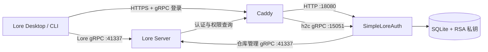

# SimpleLoreAuth

[简体中文](README.md) | [English](README.en.md)

SimpleLoreAuth 是面向 [EpicGames/lore](https://github.com/EpicGames/lore) 的独立认证与授权服务，适用于自托管 Lore Server。它实现 Lore 使用的标准认证 gRPC 接口，并提供浏览器登录、用户管理、仓库授权和仓库管理功能，无需修改 Lore 源码。

> [!IMPORTANT]
> 本项目是社区项目，不是 Epic Games 官方认证服务，也不隶属于 Epic Games。用于重要数据前，请先在受控环境中完成兼容性和备份恢复验证。

## 功能

- 实现 Lore `UrcAuthApi` 登录、令牌交换和权限查询接口；
- 实现 Lore 创建、列出和删除仓库时使用的 `RebacApi`；
- 支持 Lore Desktop 和 Lore CLI 的浏览器交互式登录；
- 使用 Argon2id 保存密码哈希，使用 SQLite 保存用户和授权数据；
- 使用 RS256 签发 JWT，并提供标准 `/.well-known/jwks.json` 端点；
- 创建、启用、禁用、删除用户及重置密码；
- 按仓库配置读取、写入、管理或完全权限；
- 提供中文网页管理后台；
- 从 Lore Server 读取仓库列表和最近 50 条提交记录；
- 支持永久删除 Lore 仓库；
- 提供包含 SimpleLoreAuth 与 Caddy 的一体化 Docker 镜像；
- 提供命令行用户和授权管理工具。

目前未实现外部 OIDC、第三方登录和 API Key 登录，相关接口会返回 `UNIMPLEMENTED`。

## 架构



登录网页、管理后台、JWKS 和认证 gRPC 共用同一个 HTTPS 地址。Lore Server 的仓库端点是另一项服务，不应与认证端点混用。

## 端口

| 端口 | 协议 | 用途 | 暴露方式 |
|---|---|---|---|
| `10443` | HTTPS + HTTP/2 | 一体化容器入口 | 映射到宿主机或上级反向代理 |
| `18080` | HTTP/1.1 | 登录、管理后台、健康检查和 JWKS | 仅容器内部回环地址 |
| `15051` | h2c gRPC | Lore 认证与授权接口 | 仅容器内部回环地址 |
| `41337` | h2c gRPC | Lore Server 仓库服务 | 由 Lore Server 独立提供 |

镜像只暴露 `10443`。`18080` 和 `15051` 仅供同一容器中的 Caddy 与 SimpleLoreAuth 通信。

## Docker 镜像

GitHub Actions 为 `linux/amd64` 和 `linux/arm64` 构建一体化镜像：

```text
ghcr.io/rogue324/simpleloreauth:latest
```

可用标签：

- `latest`：`main` 分支最新成功构建；
- `sha-xxxxxxx`：对应具体 Git 提交；
- `v1.2.3`、`1.2.3`、`1.2`：由 `v1.2.3` 版本标签生成。

可通过 `LORE_AUTH_IMAGE` 选择其他镜像标签：

```env
LORE_AUTH_IMAGE=ghcr.io/rogue324/simpleloreauth:v1.2.3
```

## 快速开始

### 1. 准备配置

```bash
cp .env.example .env
```

编辑 `.env`：

```env
LORE_AUTH_URL=https://auth.example.com:10443
LORE_AUTH_PASSWORD=replace-with-a-long-random-password
LORE_SERVER_URL=http://lore-server:41337
LORE_AUTH_TLS_MODE=manual

LORE_AUTH_DATA_DIR=./data
CADDY_CERTS_DIR=./certs
LORE_AUTH_HTTPS_PORT=10443
```

| 变量 | 必填 | 说明 |
|---|---|---|
| `LORE_AUTH_URL` | 是 | 客户端实际访问的完整 HTTPS 地址；同时作为 JWT Issuer，并用于派生 Audience 和证书域名 |
| `LORE_AUTH_PASSWORD` | 首次启动 | 创建终极管理员 `admin` 的初始密码，建议使用高强度随机密码 |
| `LORE_SERVER_URL` | 仓库管理需要 | 管理后台连接 Lore Server 的 gRPC 地址；不使用仓库管理时可留空 |
| `LORE_AUTH_TLS_MODE` | 否 | `manual`（默认）使用已有证书；`auto` 由 Caddy 申请证书 |
| `LORE_AUTH_DATA_DIR` | 否 | 宿主机持久化目录，默认 `./data` |
| `CADDY_CERTS_DIR` | 手动 TLS | 宿主机证书目录，默认 `./certs` |
| `LORE_AUTH_HTTPS_PORT` | 否 | 映射到容器 `10443` 的宿主机 TCP 端口，默认 `10443` |

终极管理员每次启动都会恢复为启用状态，并获得 `urc-*` 全局权限。该账号不能在网页后台被禁用或删除。

### 2. 配置 TLS

#### 手动证书

设置：

```env
LORE_AUTH_TLS_MODE=manual
```

将完整证书链和私钥分别保存为：

```text
./certs/server.pem
./certs/server.key
```

证书必须覆盖 `LORE_AUTH_URL` 中的域名，私钥必须与证书匹配。Compose 会将证书目录以只读方式挂载到容器 `/certs`。

#### Caddy 自动申请证书

设置：

```env
LORE_AUTH_TLS_MODE=auto
```

Caddy 会从 `LORE_AUTH_URL` 提取域名。DNS、入口端口和防火墙必须满足 ACME 验证要求，并应持久化 `/caddy-data` 和 `/caddy-config`。默认 `compose.yaml` 已配置对应卷。

### 3. 启动

```bash
docker compose pull
docker compose up -d
```

检查状态和日志：

```bash
docker compose ps
docker compose logs --tail=100 lore-auth
```

验证 HTTP 端点：

```bash
curl https://auth.example.com:10443/health
curl https://auth.example.com:10443/.well-known/jwks.json
```

健康检查应返回：

```json
{"status":"ok"}
```

## 直接运行 Docker

手动证书示例：

```bash
docker run -d \
  --name simpleloreauth \
  --restart unless-stopped \
  -p 10443:10443 \
  -e LORE_AUTH_URL=https://auth.example.com:10443 \
  -e LORE_AUTH_PASSWORD=replace-with-a-long-random-password \
  -e LORE_SERVER_URL=http://lore-server:41337 \
  -e LORE_AUTH_TLS_MODE=manual \
  -v "$PWD/data:/data" \
  -v "$PWD/certs:/certs:ro" \
  -v simpleloreauth-caddy-data:/caddy-data \
  -v simpleloreauth-caddy-config:/caddy-config \
  ghcr.io/rogue324/simpleloreauth:latest
```

镜像声明以下四个运行时环境变量，容器管理工具可以直接读取并显示它们：

- `LORE_AUTH_URL`；
- `LORE_AUTH_PASSWORD`；
- `LORE_SERVER_URL`；
- `LORE_AUTH_TLS_MODE`。

其他参数通过镜像内置默认值管理，以减少重复配置。

## 配置 Lore Server

将 `lore-server.local.toml.example` 合并到 Lore Server 的本地配置。以下关系必须严格保持一致：

- `auth_url`：SimpleLoreAuth 的完整 HTTPS 地址；
- `jwt_issuer`：必须与 `LORE_AUTH_URL` 完全相同，包括协议和非默认端口；
- `jwt_audience`：必须是 `LORE_AUTH_URL` 的主机名，不包含协议、端口或路径；
- JWK `endpoint`：在完整认证地址后追加 `/.well-known/jwks.json`。

示例：

```toml
[environment.endpoint]
auth_url = "https://auth.example.com:10443"

[server.auth]
jwt_issuer = "https://auth.example.com:10443"
jwt_audience = ["auth.example.com"]

[server.auth.jwk]
endpoint = "https://auth.example.com:10443/.well-known/jwks.json"
```

SimpleLoreAuth 会自动从 `LORE_AUTH_URL` 派生 Audience。以上示例中：

```text
LORE_AUTH_URL  = https://auth.example.com:10443
JWT Issuer     = https://auth.example.com:10443
JWT Audience   = auth.example.com
```

如果显式设置旧版高级变量 `LORE_AUTH_AUDIENCE`，它必须等于派生出的主机名，否则服务会拒绝启动并报告期望值。修改 Lore Server 配置后必须重启 Lore Server。

## 上级反向代理

如需在一体化容器前增加反向代理，应将其后端指向容器的 HTTPS `10443` 端口，并满足以下要求：

- 保留 HTTP/2；
- 支持 gRPC 长连接和 Trailers；
- 不将后端协议错误配置为明文 HTTP；
- 外部地址必须与 `LORE_AUTH_URL` 完全一致；
- 证书必须覆盖客户端访问使用的域名。

网页可以访问但 gRPC 返回 `grpc-status: 14` 时，应优先检查 HTTP/2 和 gRPC 转发设置。

## 客户端登录

Lore CLI 示例：

```bash
lore auth login lore://your-lore-server:41337
```

Lore Desktop 添加远程地址后会打开浏览器登录页面。登录成功后，客户端在本机凭据存储中保存令牌。

管理后台 Cookie 与 Lore 客户端令牌相互独立。登录 `/admin` 不代表 Lore Desktop 已完成登录。

## 网页管理后台

访问：

```text
https://auth.example.com:10443/admin
```

管理后台支持：

- 创建、启用、禁用和删除普通用户；
- 重置用户密码；
- 查看用户 ID 和状态；
- 为用户授予或撤销指定仓库权限；
- 实时查看 Lore Server 仓库；
- 查看仓库默认分支、创建者、创建时间和最近提交；
- 永久删除 Lore 仓库。

仓库管理需要正确配置 `LORE_SERVER_URL`。删除仓库是不可恢复的操作，应先验证备份。

## 命令行管理

创建用户：

```bash
docker compose exec \
  -e LORE_AUTH_PASSWORD='a-strong-user-password' \
  lore-auth lore-auth user add --username alice --display-name 'Alice'
```

列出、禁用和启用用户：

```bash
docker compose exec lore-auth lore-auth user list
docker compose exec lore-auth lore-auth user disable alice
docker compose exec lore-auth lore-auth user enable alice
```

重置密码：

```bash
docker compose exec \
  -e LORE_AUTH_PASSWORD='a-new-strong-password' \
  lore-auth lore-auth user password alice
```

管理仓库授权：

```bash
docker compose exec lore-auth lore-auth grant set alice \
  urc-0194b726b34e72b0b45550b88a967076 \
  --permissions read,write

docker compose exec lore-auth lore-auth grant list alice

docker compose exec lore-auth lore-auth grant revoke alice \
  urc-0194b726b34e72b0b45550b88a967076
```

## 数据与备份

持久目录 `/data` 中包含：

```text
lore-auth.db
jwt-private.pem
```

数据库保存账号、密码哈希、仓库授权和仓库归属记录；RSA 私钥用于签发令牌。应备份整个数据目录并严格保护私钥：

- 丢失数据库会丢失账号和授权；
- 丢失私钥会使已签发令牌失效；
- 泄露私钥会导致攻击者能够伪造令牌。

不要在需要保留数据时运行 `docker compose down -v` 或删除数据目录。

## 安全说明

- 仅终极管理员可以访问管理后台；
- 管理会话保存在内存中，有效期 8 小时；
- Cookie 使用 `Secure`、`HttpOnly` 和 `SameSite=Strict`；
- 所有管理表单使用 CSRF Token；
- 禁用用户会立即阻止新登录和新令牌交换；
- 已签发 JWT 在到期前仍可能有效；
- 不要将 `18080`、`15051` 或 SQLite 数据库暴露到不可信网络；
- 不建议向普通用户授予 `urc-*` 通配权限。

## 更新

```bash
docker compose pull
docker compose up -d --force-recreate
```

仅在开发或修改源码时使用本地构建：

```bash
docker compose -f compose.yaml -f compose.build.yaml up -d --build
```

## 故障排查

### Lore Server 显示 `Failed to connect to lore auth service`

检查 `environment.endpoint.auth_url`、TLS 证书、网络可达性以及反向代理的 HTTP/2 gRPC 支持。

### Lore Desktop 显示 `Not authenticated`

检查 `authLoginInteractive` 调试事件，确认浏览器登录完成，并确认 Lore Server 返回的 `auth_url` 与实际认证地址一致。

### Lore Server 显示 `InvalidIssuer` 或客户端不接受 Token

确认 `jwt_issuer` 与 `LORE_AUTH_URL` 完全一致，并确认 `jwt_audience` 仅为认证域名。例如 `https://auth.example.com:10443` 的 Audience 必须是 `auth.example.com`。

### SQLite 显示 `Unable to open the database file`

确保数据目录存在，并且容器用户 UID `10001` 具有写权限：

```bash
mkdir -p data
chmod 770 data
```

### Caddy TLS 握手失败

确认 `/certs/server.pem` 包含完整证书链，`/certs/server.key` 与证书匹配，并检查挂载文件的读取权限。

## 本地开发

```bash
cargo fmt --all -- --check
cargo test --locked
cargo clippy --all-targets --locked -- -D warnings
```

仅用于回环地址的明文开发启动：

```bash
cargo run --locked -- \
  --data-dir ./data \
  serve \
  --public-base-url http://127.0.0.1:18080 \
  --issuer http://127.0.0.1:18080 \
  --bootstrap-username admin \
  --bootstrap-password a-long-development-password
```

## 许可证

[MIT](LICENSE)
