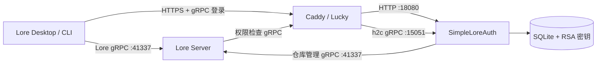

# SimpleLoreAuth

[简体中文](README.md) | [English](README.en.md)

一个面向家庭 NAS、小型团队和私有网络部署的
[EpicGames/lore](https://github.com/EpicGames/lore) 独立认证与权限服务。

SimpleLoreAuth 实现了 Lore 客户端和 Lore Server 使用的认证 gRPC 接口，并提供中文网页管理后台、用户名密码登录、用户管理、仓库授权以及仓库管理能力。它通过标准协议接入 Lore，不需要修改 Lore 源码。

> [!IMPORTANT]
> 本项目是社区项目，不是 Epic Games 官方认证服务，也不隶属于 Epic Games。请先在可信的测试环境中验证，再用于重要数据。

## 主要功能

- 实现 Lore `UrcAuthApi` gRPC 登录、令牌交换和权限查询协议；
- 实现 Lore 创建、列出和删除仓库时使用的 `RebacApi`；
- 浏览器用户名/密码登录，兼容 Lore Desktop 和 Lore CLI 的交互式登录；
- SQLite 用户数据库，密码使用 Argon2id 哈希保存；
- RS256 JWT 和标准 `/.well-known/jwks.json` 公钥端点；
- 普通用户启用/禁用、修改密码、创建和删除；
- 按仓库授予只读、读写、仓库管理或完全权限；
- 中文网页管理后台；
- 从 Lore Server 实时读取仓库列表；
- 查看仓库最近 50 条提交历史；
- 输入仓库名称二次确认后永久删除仓库；
- Docker Compose、Caddy HTTPS 和 gRPC/h2c 部署配置；
- 命令行用户与授权管理工具。

目前未实现外部 OIDC、第三方登录和 API Key 登录，相关调用会返回 `UNIMPLEMENTED`。

## 工作方式



HTTP 登录网页和认证 gRPC 共用同一个公网地址。Lore Server 的仓库端口是另一项独立服务，不要将两者混淆。

## 端口说明

| 端口 | 协议 | 用途 | 是否建议公网暴露 |
|---|---|---|---|
| `18080` | HTTP/1.1 | 登录网页、管理后台、健康检查和 JWKS | 否 |
| `15051` | h2c gRPC | Lore 认证与权限接口 | 否 |
| `10443` | HTTPS + HTTP/2 | Caddy 对外统一入口 | 是，或仅提供给上级反向代理 |
| `41337` | h2c gRPC | Lore Server 仓库服务，属于 Lore Server | 按实际网络需求 |

`18080` 和 `15051` 在 Compose 网络内使用明文协议，应只存在于可信主机或 Docker 网络中。

## 预编译 Docker 镜像

GitHub Actions 会在每次推送到 `main`、推送 `v*` 版本标签或手动运行工作流时，自动构建并发布 `linux/amd64` 和 `linux/arm64` 镜像：

```text
ghcr.io/rogue324/simpleloreauth:latest
```

可用标签：

- `latest`：`main` 分支最新成功构建；
- `sha-xxxxxxx`：对应具体 Git 提交；
- `v1.2.3`、`1.2.3`、`1.2`：推送 `v1.2.3` 标签时自动生成。

默认 `compose.yaml` 直接拉取预编译镜像，不再在 NAS 上编译 Rust。可通过 `LORE_AUTH_IMAGE` 指定其他标签：

```env
LORE_AUTH_IMAGE=ghcr.io/rogue324/simpleloreauth:v1.2.3
```

> [!NOTE]
> 个人 GitHub 账户首次发布的 GHCR 包默认为私有。第一次 Action 成功后，在 GitHub 个人主页的 **Packages → simpleloreauth → Package settings → Change visibility** 中将其设为 **Public**，NAS 才能匿名拉取。公开后不能再改回私有；如果希望保持私有，则需要先在 NAS 上执行 `docker login ghcr.io`。

## 快速部署

### 1. 准备配置

```bash
cp .env.example .env
```

编辑 `.env`：

```env
LORE_AUTH_DOMAIN=auth.example.com
LORE_AUTH_PUBLIC_BASE_URL=https://auth.example.com:10443
LORE_AUTH_ISSUER=https://auth.example.com:10443
LORE_AUTH_AUDIENCE=lore-service
LORE_AUTH_ENVIRONMENT=home
LORE_AUTH_TOKEN_TTL_SECONDS=3600
LORE_AUTH_LORE_GRPC_URL=http://192.168.1.10:41337
LORE_AUTH_BOOTSTRAP_USERNAME=admin
LORE_AUTH_BOOTSTRAP_PASSWORD=请替换为至少十位的高强度密码
```

变量说明：

| 变量 | 必填 | 说明 |
|---|---|---|
| `LORE_AUTH_DOMAIN` | 是 | 证书域名，只写域名，不要带协议、端口或路径 |
| `LORE_AUTH_PUBLIC_BASE_URL` | 是 | 客户端实际访问的完整公网地址，包含非标准端口 |
| `LORE_AUTH_ISSUER` | 是 | JWT issuer；必须和 Lore Server 的 `jwt_issuer` 完全一致 |
| `LORE_AUTH_AUDIENCE` | 否 | JWT audience，默认 `lore-service` |
| `LORE_AUTH_ENVIRONMENT` | 否 | 写入令牌的环境标识，默认 `local` |
| `LORE_AUTH_TOKEN_TTL_SECONDS` | 否 | JWT 有效期，默认 3600 秒 |
| `LORE_AUTH_LORE_GRPC_URL` | 仓库后台需要 | 管理后台连接 Lore Server 的内部 gRPC 地址 |
| `LORE_AUTH_BOOTSTRAP_USERNAME` | 是 | 终极管理员账号，默认 `admin` |
| `LORE_AUTH_BOOTSTRAP_PASSWORD` | 首次启动需要 | 首次创建终极管理员时使用的密码 |

终极管理员每次启动都会恢复为启用状态，并获得 `urc-*` 全局权限。该账号不能在网页后台被禁用或删除。

### 2. 选择 TLS 方式

#### 方式 A：Caddy 自动申请证书

默认 `Caddyfile` 使用 `LORE_AUTH_DOMAIN` 自动管理证书。域名和网络必须满足 Caddy/ACME 的验证要求。

```bash
docker compose pull
docker compose up -d
```

#### 方式 B：Lucky/其他反向代理 + 已有证书

将证书和私钥放入：

```text
certs/server.pem
certs/server.key
```

使用手动证书配置：

```bash
cp Caddyfile.manual-tls.example Caddyfile
docker compose pull
docker compose up -d
```

如果公网使用 `https://auth.example.com:2234`，`.env` 必须相应写成：

```env
LORE_AUTH_PUBLIC_BASE_URL=https://auth.example.com:2234
LORE_AUTH_ISSUER=https://auth.example.com:2234
```

Lucky 后端示例：

```text
后端地址：https://NAS局域网IP:10443
忽略后端 TLS 证书验证：是
grpc 使用安全连接：是
禁用长连接：否
```

必须保留 HTTP/2。若普通网页正常但 gRPC 返回 `grpc-status: 14`，通常是 Lucky 没有启用“grpc 使用安全连接”。

### 3. 验证认证服务

```bash
docker compose ps
curl https://auth.example.com:10443/health
curl https://auth.example.com:10443/.well-known/jwks.json
```

健康检查应返回：

```json
{"status":"ok"}
```

查看日志：

```bash
docker compose logs --tail=100 caddy lore-auth
```

## 配置 Lore Server

将 `lore-server.local.toml.example` 中的内容合并到 Lore Server 的本地配置。三个公网地址必须使用完全相同的协议、域名和端口：

```toml
[environment.endpoint]
auth_url = "https://auth.example.com:10443"

[server.auth]
jwt_issuer = "https://auth.example.com:10443"
jwt_audience = ["lore-service"]

[server.auth.jwk]
endpoint = "https://auth.example.com:10443/.well-known/jwks.json"
```

如果认证服务实际公网端口是 `2234`，这里三处都必须改为 `2234`。修改后重启 Lore Server。

`environment.endpoint.auth_url` 会同时提供给 Lore 客户端，并被 Lore Server 用于权限查询。地址写错时，客户端调试日志会出现：

```text
starting auth session failed to connect to auth endpoint
```

## 客户端登录

CLI 示例：

```bash
lore auth login lore://your-lore-server:41337
```

Lore Desktop 添加远程地址后会自动打开登录网页。成功页面会显示“身份验证成功”，随后客户端在本机安全凭据目录中保存令牌。

管理后台登录 Cookie 与 Lore Desktop 登录令牌互相独立：登录过 `/admin` 不代表 Lore Desktop 已经登录。

## 中文管理后台

访问：

```text
https://auth.example.com:10443/admin
```

后台支持：

- 创建、启用、禁用和删除普通用户；
- 重置用户密码；
- 查看用户 ID 和状态；
- 为用户授予或撤销指定仓库权限；
- 实时查看 Lore Server 中的仓库；
- 查看仓库默认分支、创建者、创建时间和提交历史；
- 永久删除 Lore 仓库。

仓库管理要求配置：

```env
LORE_AUTH_LORE_GRPC_URL=http://NAS局域网IP:41337
```

删除仓库是不可恢复的硬删除，请先备份 Lore 数据目录。

## 命令行管理

创建用户：

```bash
docker compose exec \
  -e LORE_AUTH_PASSWORD='用户的高强度密码' \
  lore-auth lore-auth user add --username alice --display-name 'Alice'
```

列出、启用和禁用用户：

```bash
docker compose exec lore-auth lore-auth user list
docker compose exec lore-auth lore-auth user disable alice
docker compose exec lore-auth lore-auth user enable alice
```

重置密码：

```bash
docker compose exec \
  -e LORE_AUTH_PASSWORD='新的高强度密码' \
  lore-auth lore-auth user password alice
```

仓库授权：

```bash
docker compose exec lore-auth lore-auth grant set alice \
  urc-0194b726b34e72b0b45550b88a967076 \
  --permissions read,write

docker compose exec lore-auth lore-auth grant list alice

docker compose exec lore-auth lore-auth grant revoke alice \
  urc-0194b726b34e72b0b45550b88a967076
```

## 数据与备份

持久数据位于：

```text
./data/lore-auth.db
./data/private-key.pem
./data/public-key.pem
```

数据库保存用户、密码哈希、仓库授权和仓库归属记录。RSA 私钥用于签发令牌。请备份整个 `data` 目录，并严格保护私钥：

- 丢失数据库会丢失账号和授权；
- 丢失私钥会使已签发令牌失效；
- 泄露私钥会导致攻击者能够伪造令牌。

`.env`、`data/`、`certs/` 和 `target/` 默认不会提交到 Git。

## 安全说明

- 管理后台仅允许终极管理员登录；
- 管理会话保存在内存中，有效期 8 小时；
- Cookie 使用 `Secure`、`HttpOnly` 和 `SameSite=Strict`；
- 所有管理表单使用 CSRF Token；
- 禁用用户会立即阻止新登录和新令牌交换；
- 已签发 JWT 在到期前仍可能有效，可缩短 `LORE_AUTH_TOKEN_TTL_SECONDS`；
- 不要把 `18080`、`15051` 或 SQLite 数据库暴露到不可信网络；
- 不建议向普通用户授予 `urc-*` 通配权限。

## 更新

使用预编译镜像更新：

```bash
docker compose pull
docker compose up -d --force-recreate
```

不要删除 `data` 目录，也不要使用 `docker compose down -v`，否则可能清除持久数据或 Caddy 状态。

仅在开发或修改源码时本地构建：

```bash
docker compose -f compose.yaml -f compose.build.yaml up -d --build
```

## 常见问题

### 网页正常，但 Lore Server 显示 `Failed to connect to lore auth service`

检查：

1. `environment.endpoint.auth_url` 是否为实际公网认证地址；
2. 反向代理是否支持 HTTP/2 gRPC；
3. Lucky 是否启用了“grpc 使用安全连接”；
4. Caddy 的 gRPC 上游是否使用 `h2c`。

### Lore Desktop 显示 `Not authenticated`

查看 `authLoginInteractive` 调试事件。确认浏览器登录成功，并确认 Lore Server 返回的 `auth_url` 端口正确。管理后台登录不能替代客户端登录。

### SQLite 报 `Unable to open the database file`

确保 `./data` 存在且容器用户有写入权限：

```bash
mkdir -p data
chmod 770 data
```

### Caddy TLS 握手失败

检查证书挂载路径、证书与私钥是否匹配，以及 `Caddyfile` 中的路径是否为容器内 `/certs/...`。

## 本地开发

```bash
cargo fmt --all -- --check
cargo test --locked
cargo clippy --all-targets --locked -- -D warnings
```

仅用于回环地址的明文开发启动：

```bash
cargo run --locked -- \
  --data-dir ./data \
  serve \
  --public-base-url http://127.0.0.1:18080 \
  --issuer http://127.0.0.1:18080 \
  --bootstrap-username admin \
  --bootstrap-password a-long-development-password
```

## 许可证

[MIT](LICENSE)
